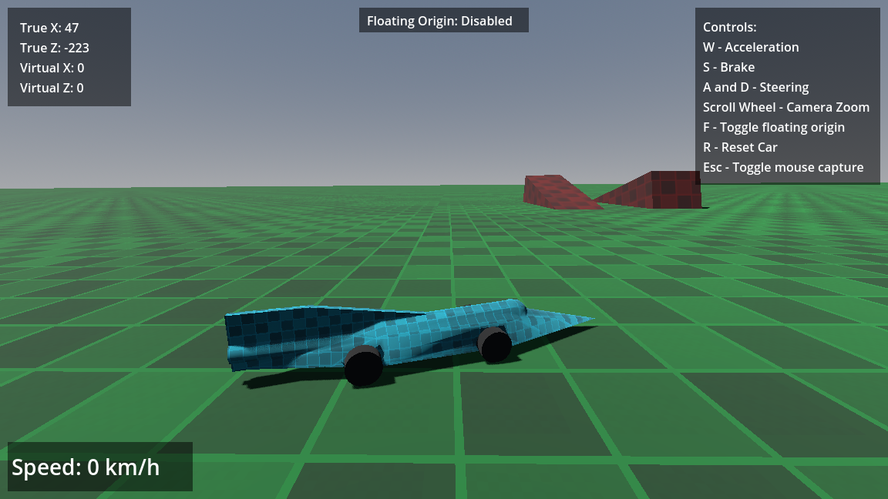

# Horizontal Floating Origin Solution written in C# for Godot

## Description
This repository presents a naive VehicleBody3D-compatible horizontal floating origin solution written in C# for the Godot Engine (version 4.3).
## Idea
- Define "anchor vehicle" as a VehicleBody3D that is pinned at (or near) the center of the Godot physics world. 
- Define "true velocity" as the velocity of a vehicle relative to the Godot physics world.
  This velocity is obtained using the engine's LinearVelocity property for the RigidBody class.
- Define "virtual velocity" as the velocity of a vehicle relative to the world underfoot. 
- The anchor vehicle may not possess both a nonzero true velocity and nonzero virtual velocity simultaneously. 
  Either one velocity or the other may be nonzero depending on if the origin is floating or not.
- When floating origin mode is enabled, any time the anchor vehicle possesses a true nonzero horizontal (X or Z axis) velocity, said velocity is immediately converted into virtual velocity.
- The virtual velocity determines how fast the world's collider will move under the wheels of the anchor vehicle, much like a treadmill.
## Applications
- Open world ground vehicle games.
- Low altitude flight simulators.
## Limitations
- The origin only floats on the X and Z axes, not the Y axis.
  This solution will not work at very high and very low (subterranean) altitudes
- Vehicle handling changes significantly when switching between floating and non-floating origin.
  There are noticeable changes in acceleration, braking and tire traction. 
  One must tweak vehicle characteristics specifically for floating origin usage.
- Tire friction and air drag is seemingly non-existent when using floating origin mode.
  One must calculate friction/drag manually and apply it to the anchor vehicle's virtual velocity during the physics process step.
- This solution does not cooperate with Godot Jolt Physics.